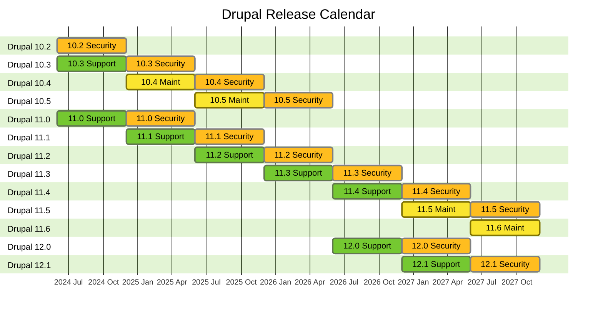

# Drupal Release Calendar

[View it in GitLab](https://git.drupalcode.org/project/drupal/-/blob/11.x/RELEASES-CALENDAR.md)

_Dates are subject to change. Visit the [schedule](https://www.drupal.org/about/core/policies/core-release-cycles/schedule) page for the most up to date information._

---

### Export graph as image

- Copy the mermaid markdown code
  - If you are viewing the file via the GitLab UI, use the `Copy to Clipboard` button.
  - If you are editing this file, copy the mermaid markdown (do not include the wrapping backticks).

 - Go to the [Mermaid Live](https://mermaid.live) editor
   - Paste the code you just copied.
   - Find the `Actions` dropdown, then select the desired format button to download an export of the graph.
